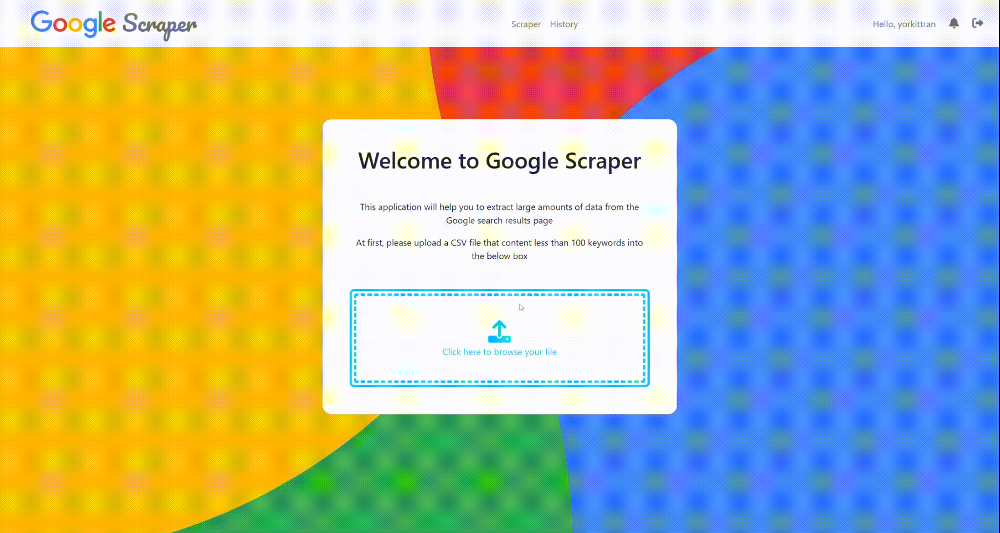

# Google Scraper



## Features

- Scrap Google search with uploaded CSV file contains keywords
- View scrapped stats of keywords with Hotwire implemented to have a better UX
- Response notification to users when finish scrapping

## Installation

To clone and run this application, you'll need to setup

- Ruby
- Ruby on Rails
- PostgreSQL Server
- Redis Server
- ChromeDriver

```bash
# Clone this repository
$ git clone https://github.com/yorkittran/google-scraper.git

# Go into the repository
$ cd google-scraper

# Install gems and dependencies
$ bundle install

# Run the app
$ rails server
```

Also, you should prepare a CSV file that contains less than 100 keywords without header like this

```csv
keyword A
keyword B
keyword C
```

## Problem Solving

I chose nokogori gem to crawling data, but Google not shows the search stats (total results and search time) immediately when I go to the search result page cause the stats are handled by Javascript

> Using Watir that based on Selenium to scrap the data. Though it is successfully, it not bring a good performance

Google may blocked an IP that has so many requests to it. Thought Watir will avoid that cause this is a headless browser, Google still have a way to prevents them

> Buying proxies to reduce the block from Google, but sometimes I can avoid that so I have to notify users which keyword was failed to scrap

Using `sidekiq` alone may cause leak of memory

> Workaround `sidekiq-batch` to reduce it, maybe change to `push_bulk` to get a better performace

After finish the background job, create a notification but users have to reload to see it

> Implement ActionCable to notify users immediately

## Credit

> [yorkittran.is-not-a.dev](https://yorkittran.is-not-a.dev/) &nbsp;&middot;&nbsp;
> GitHub [@yorkittran](https://github.com/yorkittran)
